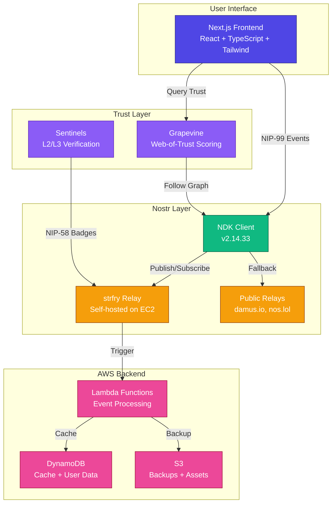

# System Architecture

```mermaid
graph TB
    subgraph "User Interface"
        A[Next.js Frontend<br/>React + TypeScript + Tailwind]
    end

    subgraph "Nostr Layer"
        B[NDK Client<br/>v2.14.33]
        C[strfry Relay<br/>Self-hosted on EC2]
        D[Public Relays<br/>damus.io, nos.lol]
    end

    subgraph "AWS Backend"
        E[Lambda Functions<br/>Event Processing]
        F[DynamoDB<br/>Cache + User Data]
        G[S3<br/>Backups + Assets]
    end

    subgraph "Trust Layer"
        H[Sentinels<br/>L2/L3 Verification]
        I[Grapevine<br/>Web-of-Trust Scoring]
    end

    A -->|NIP-99 Events| B
    B -->|Publish/Subscribe| C
    B -->|Fallback| D
    C -->|Trigger| E
    E -->|Cache| F
    E -->|Backup| G
    A -->|Query Trust| I
    H -->|NIP-58 Badges| C
    I -->|Follow Graph| B

    style A fill:#4f46e5,stroke:#312e81,color:#fff
    style B fill:#10b981,stroke:#065f46,color:#fff
    style C fill:#f59e0b,stroke:#92400e,color:#fff
    style D fill:#f59e0b,stroke:#92400e,color:#fff
    style E fill:#ec4899,stroke:#9f1239,color:#fff
    style F fill:#ec4899,stroke:#9f1239,color:#fff
    style G fill:#ec4899,stroke:#9f1239,color:#fff
    style H fill:#8b5cf6,stroke:#5b21b6,color:#fff
    style I fill:#8b5cf6,stroke:#5b21b6,color:#fff
```
