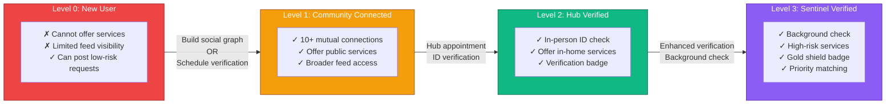

# Trust Ladder - User Progression

```mermaid
graph LR
    subgraph L0["Level 0: New User"]
        L0A["✗ Cannot offer services<br/>✗ Limited feed visibility<br/>✓ Can post low-risk requests"]
    end

    subgraph L1["Level 1: Community Connected"]
        L1A["✓ 10+ mutual connections<br/>✓ Offer public services<br/>✓ Broader feed access"]
    end

    subgraph L2["Level 2: Hub Verified"]
        L2A["✓ In-person ID check<br/>✓ Offer in-home services<br/>✓ Verification badge"]
    end

    subgraph L3["Level 3: Sentinel Verified"]
        L3A["✓ Background check<br/>✓ High-risk services<br/>✓ Gold shield badge<br/>✓ Priority matching"]
    end

    L0 -->|Build social graph<br/>OR<br/>Schedule verification| L1
    L1 -->|Hub appointment<br/>ID verification| L2
    L2 -->|Enhanced verification<br/>Background check| L3

    style L0 fill:#ef4444,stroke:#991b1b,color:#fff
    style L1 fill:#f59e0b,stroke:#92400e,color:#fff
    style L2 fill:#10b981,stroke:#065f46,color:#fff
    style L3 fill:#8b5cf6,stroke:#5b21b6,color:#fff
```
