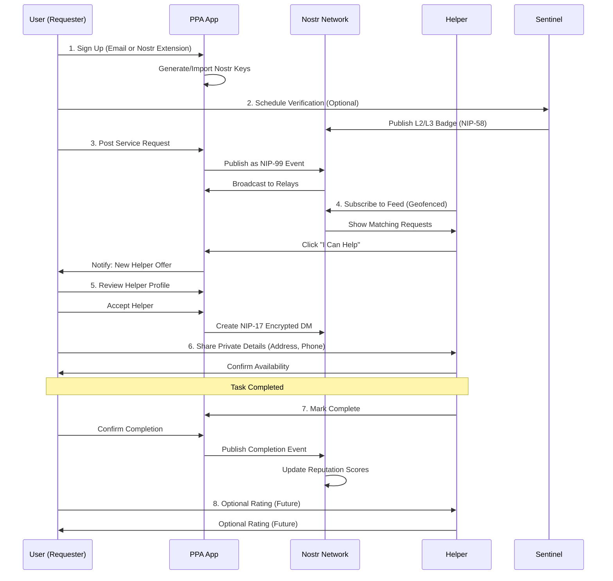

# Core User Flow - Request to Completion

```mermaid
sequenceDiagram
    participant U as User (Requester)
    participant A as PPA App
    participant N as Nostr Network
    participant H as Helper
    participant S as Sentinel

    U->>A: 1. Sign Up (Email or Nostr Extension)
    A->>A: Generate/Import Nostr Keys
    U->>S: 2. Schedule Verification (Optional)
    S->>N: Publish L2/L3 Badge (NIP-58)

    U->>A: 3. Post Service Request
    A->>N: Publish as NIP-99 Event
    N->>A: Broadcast to Relays

    H->>N: 4. Subscribe to Feed (Geofenced)
    N->>H: Show Matching Requests
    H->>A: Click "I Can Help"
    A->>U: Notify: New Helper Offer

    U->>A: 5. Review Helper Profile
    U->>A: Accept Helper
    A->>N: Create NIP-17 Encrypted DM

    U->>H: 6. Share Private Details (Address, Phone)
    H->>U: Confirm Availability

    Note over U,H: Task Completed

    H->>A: 7. Mark Complete
    U->>A: Confirm Completion
    A->>N: Publish Completion Event
    N->>N: Update Reputation Scores

    U->>H: 8. Optional Rating (Future)
    H->>U: Optional Rating (Future)
```
